## Citi Bike Data Visualization

This is to visualize the Citi Bike data using Tabeau.

This is to aggregate the data found in the Citi Bike Trip History Logs to build a data dashboard, story, or report.  

## Total Trips
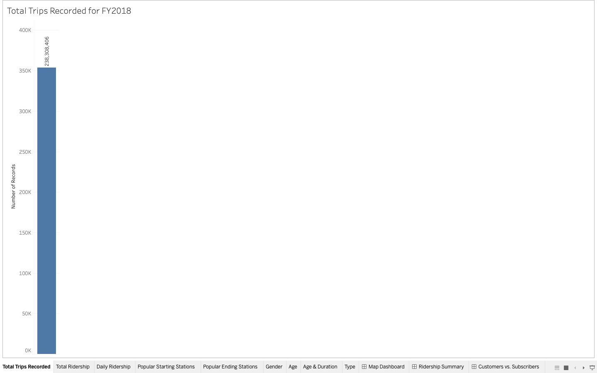

### Total Ridership
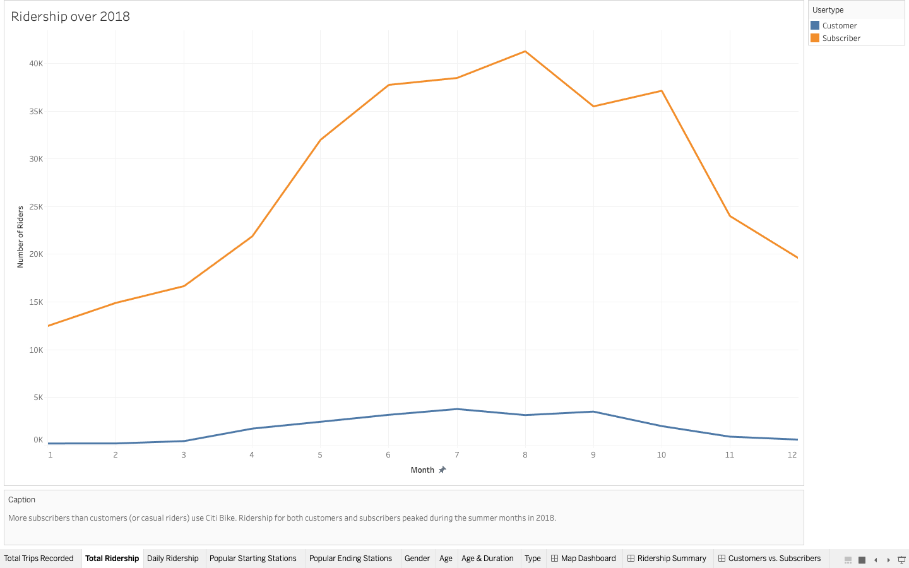

### Daily Ridership 
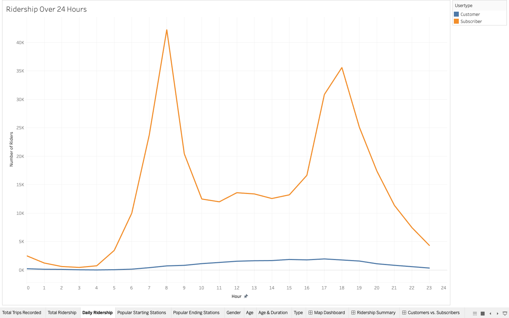

### Popular Starting Stations
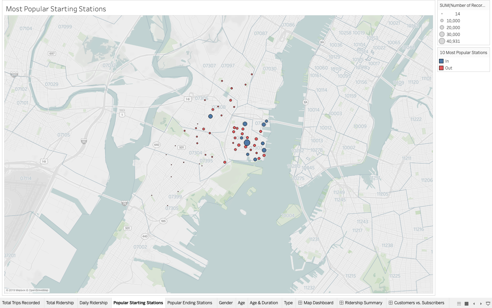

### Popular Ending Stations
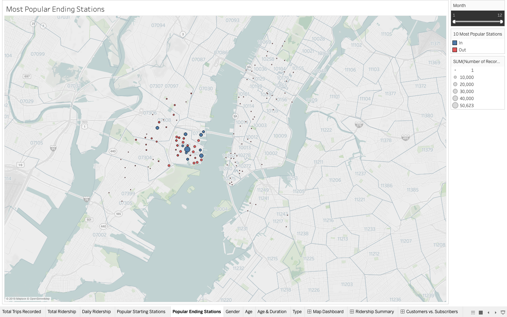 

### Gender
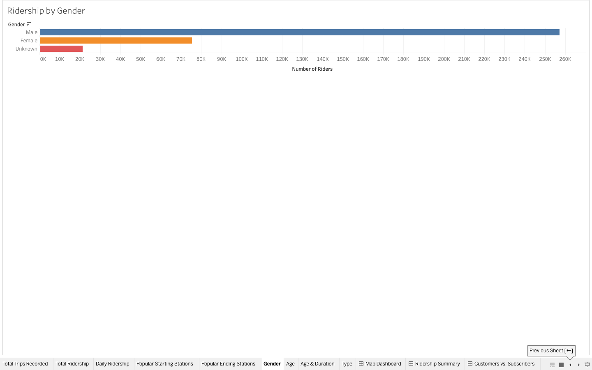 
 
### Age
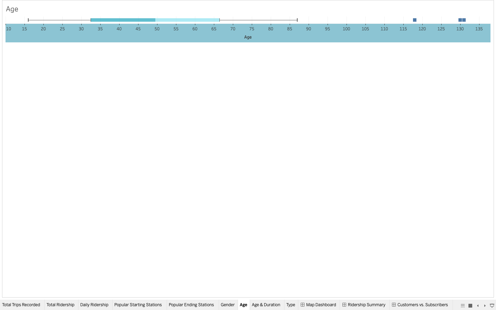 

### Age & Duration
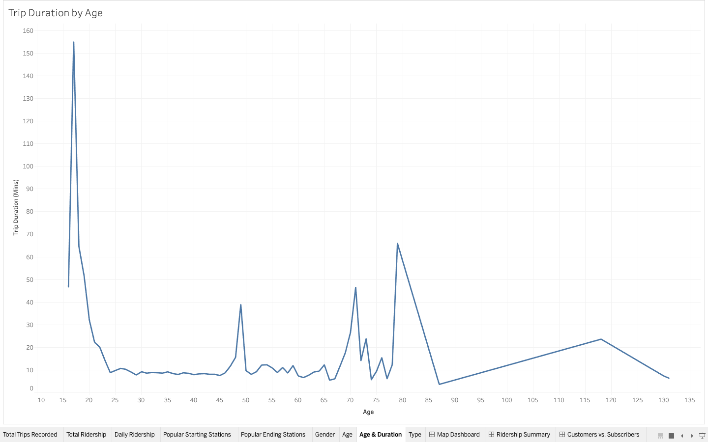 

### Type
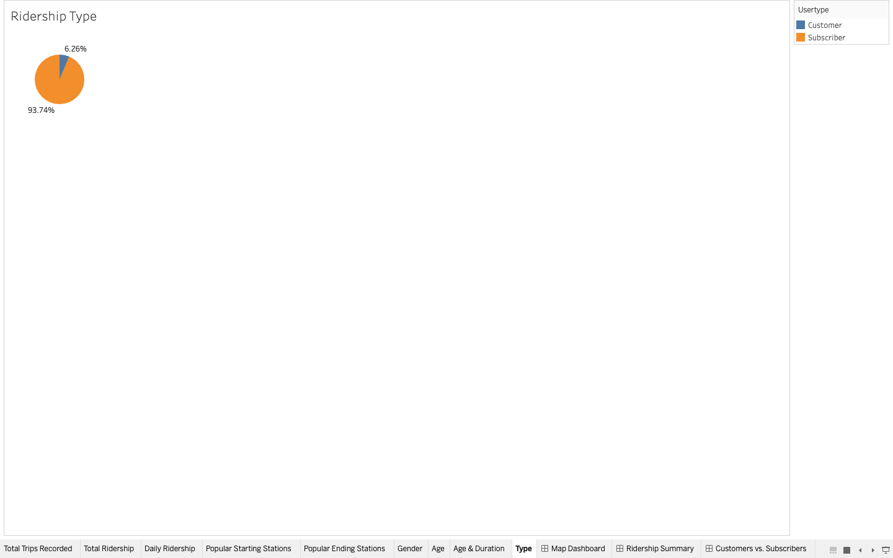 
 
### MapDashBoard
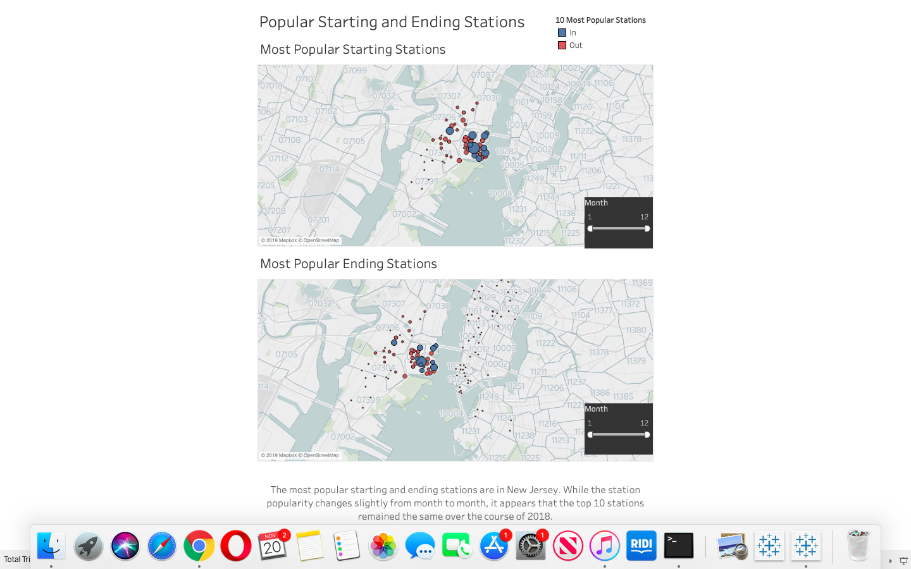 

### Ridership Summary
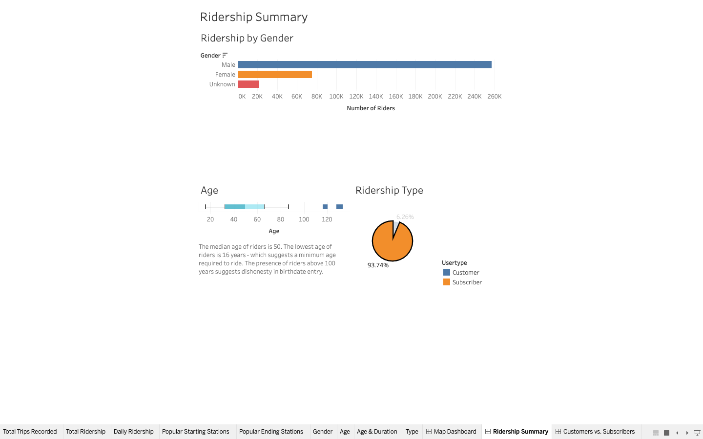 

### Customers
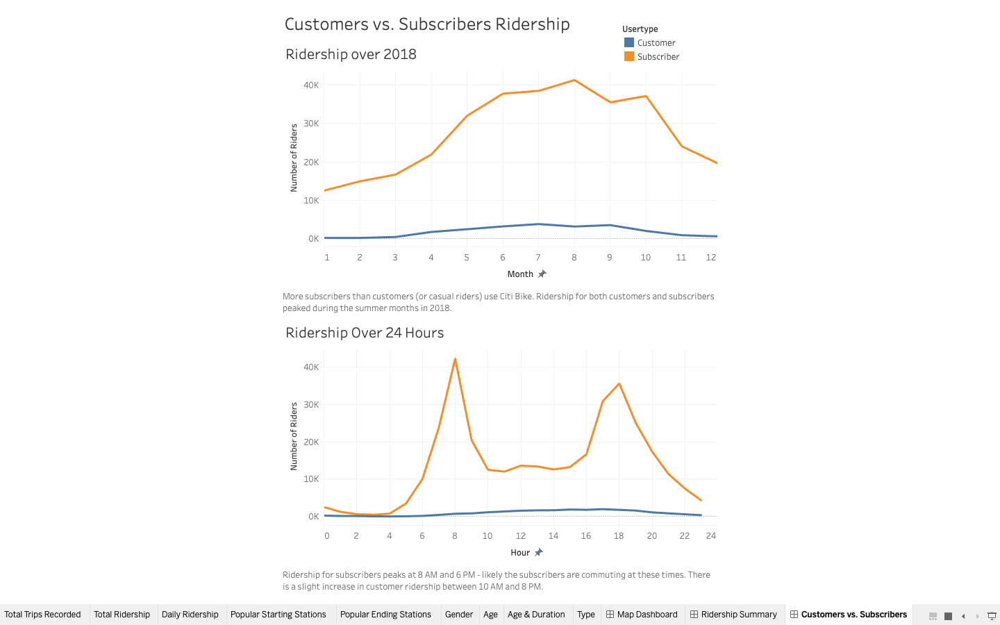 

